# 一:Git

### 版本管理

编码的时候有些节点非常关键,那我们就可以存个档,以防出现代码丢失等意外.

理解游戏存档

### 常见版本管理软件

1.svn

2.git

​     安装 

​        选中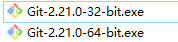直接一直下一步

​        右键出现git bash就表示成功

​                 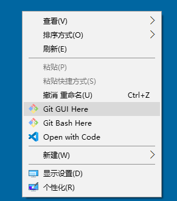

### git使用步骤

1.新建一个文件夹 (新建的仓库和编写的代码都写在这个文件夹中)

2.进入到文件夹, 右键 点击  Git Bash Here ,他就会出现一个小黑框

3.就在小黑框里写:  git init    (意思是初始化一个仓库)

​    会出现一个隐藏的.git文件夹. 不要动这个文件夹.

4.吃着火锅,愉快的敲着代码..

5.git  add  .

​	git   commit   -m "描述提交的代码"


##### 补充: 

​    如果是第一次执行add commit,会出现下面这个问题

​                    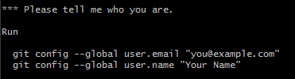

​      这个问题的意思是: 设置你邮箱和用户名, 这个问题只会在第一次出现.   

​      注意的是:设置的时候一个一个的设置


​     git status

​                    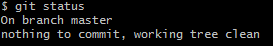就表示add commit 成功的

​      git  log

​                   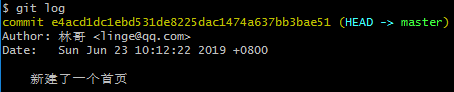查看提交日志,

​                   有的时候会卡死, 卡死按q退出.    或者ctrl+c两次退出


##### 出现的问题 :

 1.新建编写代码的文件夹,要进到文件夹里面去之后, 右键点击git bash here

 2.git init 不要写错, 出现一个.git影藏文件夹, 如果没有出现这个文件夹,检查一下自己的电脑隐藏文件夹是不是不显示.

 3.我们要提交内容, 那首先得有内容. 意思就是要写点代码, 代码要和上次不一样.

 4.git add .   

​    git commit -m"描述的信息"

​    这两句代码  add 和后面的点 有空格.   commit 和-m中间也有空格.

 5.第一次提交会出现让你输入邮箱和用户名, 一行代码一行代码的执行. 复制的时候不要把后面的空格给复制来额


##### 查看设置的邮箱和用户名

​	  	git  config  user.email

​          git  config  user.name

#####  修改用户邮箱和用户名:

第一种办法:  直接重新再设置一下,他就会覆盖.

​          git config --global user.email "you@example.com"
​          git config --global user.name "Your Name" 

第二种办法:  退出再登录

​        退出:

​         git  config  --global   --unset  user.email

​         git  config  --global   --unset  user.name

​         推荐大家使用 github注册的邮箱和用户名来登录.

​                       

### git版本穿梭(回滚)

命令:   git    reset    --hard  版本号       //版本回滚的命令

命令:  git  log --oneline          //查看一行类型的日志,包括版本号

​              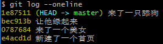前面黄色的就是版本号

命令:  git  reflog     //查看所有的日志,包括回滚的日志


### 本地git工作流程

###          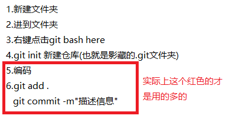


# 二:github

### 远程仓库

以下这些都可以作为远程仓库.

1.github

2.gitlab

3.码云

4.公司的机房里某一台服务器(电脑)

5.....

### github 是什么

<https://github.com/>

1.是一个免费的远程仓库 (我们可以把我们写的代码存在这个网站里面)

2.是一个代码托管平台,很多优秀的开源的项目都有放在github上,供大家学习/使用.

3.自嘲:"全球最大的同性交友网站"


##### github和git有关系吗?

没有,就是名字长的很像而已, 就像北大和北大某鸟的关系... 雷锋和雷峰塔....

git是代码版本管理工具, 同样的工具还要svn等之类的.

github是一个代码托管平台.


##### 用github远程仓库托管代码使用步骤:

使用远程仓库有2中用法:
1: 新建一个空的远程仓库, 和已经存在的本地仓库取得关联
2: 新建一个非空的远程仓库, 克隆到本地, 克隆到本地的就是本地仓库


##### 一:创建github克隆本地仓库

1.建立远程仓库

​	1.1 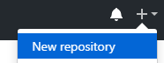

​	1.2  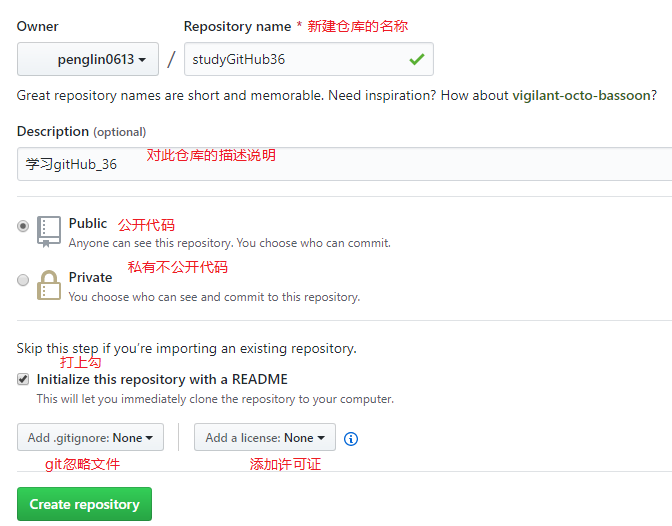

   

2.把远程仓库克隆到本地

​        2.1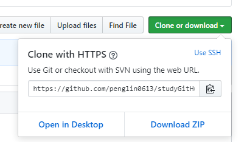

​       2.2 复制一下这个远程仓库的地址

​       2.3  来到   本地你需要把这个仓库 放到所在地 的文件夹.  右键点击git bash here

​           命令:  git clone 仓库地址

​           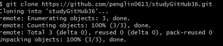

​           出现了done就说明克隆完成,  在当前文件夹就会出现一个和远程仓库名字一毛一样的一个文件夹.

   3.在本地编码

4. add  commit  提交到本地仓库 

      注意啦: 编码提交到本地,一定要进入到这个文件夹中去. 再右键点击git gitHub here 出来小黑框 

   

5. 推送到远程仓库

   命令: git push

    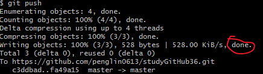

    出现了这个done就说明ok了.


##### 二:gitHub新建一个空的远程仓库 关联已有的本地仓库

​		新建远程仓库的时候,不要打上勾,

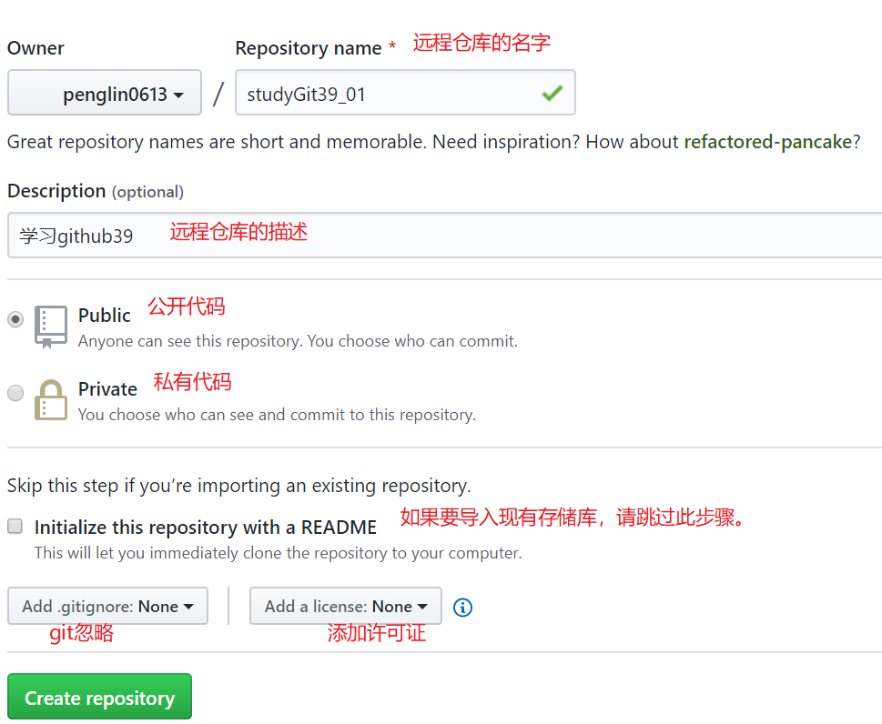

​        进去执行那两行命令.

```
git remote add origin https://github.com/penglin0613/studyGit39_01.git
git push -u origin master
```

完成后刷新远程仓库, 就有了之前本地提交的信息.


就是让你去新建一个readMe.md文档, 用这个文档来介绍你的项目.

在本地建了一个readme.md文件, 通过git add.  git commit-m"" 提交到了本地仓库,  通过git push推送到远程. 


##### 如何删除gitHub仓库

1.找到你要删除的库.

2.点击

3.   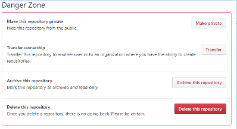

4.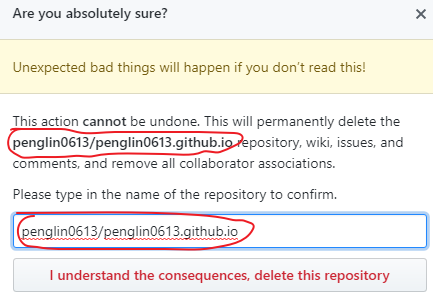

5.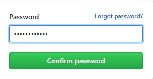


### git辅助工具

#### 1.vscode自带的小黑框-终端

1. 1vscode自带小黑框(终端)

      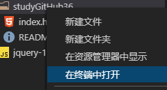

2. 2注意,一定要注意路径的问题,  一定要是在git管理的那个文件夹下.

#### 2.vscode自带了一个不用写命令的工具

 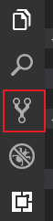

2.1 选中你要add的文件, 点加号,  就相当于git add .

2.2 点击勾勾√  , 就相当于  git commit -m""

2.3 点击...后,选择推送  ,  就相当于是git push


#### 3.像vscode自带的git这样的工具有很多种.

 TortoiseGit  小乌龟

  sourceTree  

  GitHubDeskTop  小紫猫/章鱼猫     Github官方推出的.

 

3.1  小紫猫的使用.​     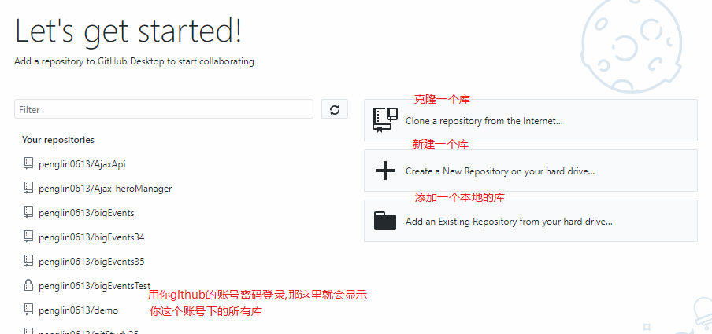 

 

 


# 三:git分支 branch

我们现在写代码,都是写在一个默认的主分支(master)里,这样其实是不对的.

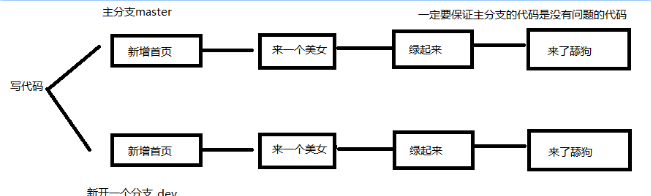

#### 3.1 使用 步骤

1.新建仓库,就会有一个默认的master分支.
			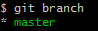

2.新建分支   git branch 分支名

​		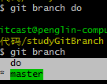

3.切换到分支写代码,切换分支  git checkout 分支名

​		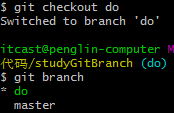

4.在新分支上编码, 编码后 add commit , 提交到新分支​		

5.切回到主分支后合并新分支   git merge 分支名

  	注意:要回到主分支再合并

6.删除新分支   git branch -d 分支名

​	注意:回到主分支再删除次分支


补充: git branch  查看分支


#### 3.2 图形化工具 结合git使用流程

1.新建分支

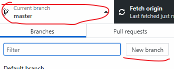

2.合并分支

​		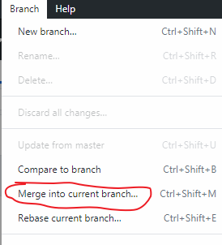

3.删除分支,注意在小紫猫里,要切换到删除的分支才能删

​		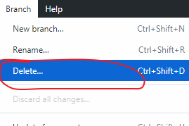

#### 3.3 工作中的分支使用(记忆)

​     新建仓库就有有一个默认的主分支. 

​	1.主分支(master),一定是不能直接在上面写代码的.

​	    master上面的代码一定是没有问题,可以运行起来的,

​	    master分支上的代码一般用来做上线, 做版本发布.

​    2.写代码一定有一个开发分支(dev).

​		一定是没有问题的代码才合并到master分支上. 


# 四:git pull

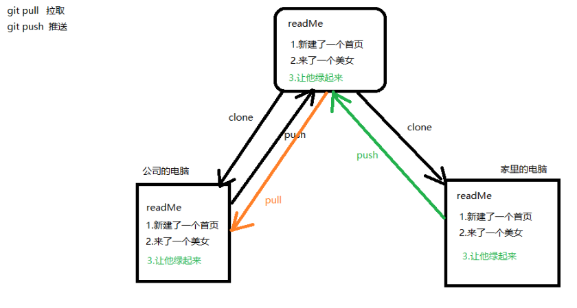


# 五:git 工作图解

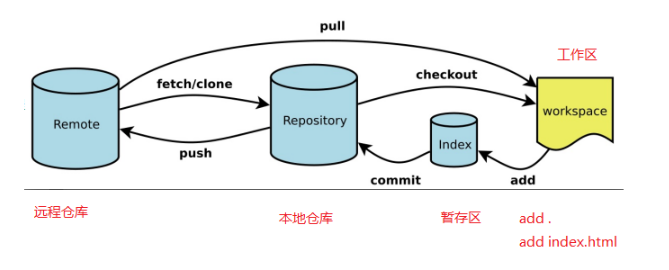


# 六:制作github个人主页

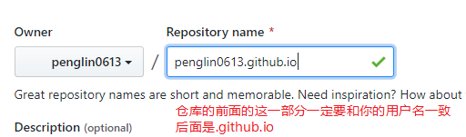

把这个新建的库克隆到本地

   

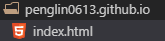

这个文件夹里面一定要有一个index.html页面


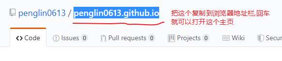


注意:

​       不要往这个个人主页这个文件夹里面丢java,c#等其他语言的代码.

​       不要丢之前写的图灵的聊天机器人


廖雪峰讲git:

https://www.liaoxuefeng.com/wiki/896043488029600/896067008724000

https://www.liaoxuefeng.com/wiki/1022910821149312

http://www.ruanyifeng.com/blog/2015/07/flex-examples.html

http://es6.ruanyifeng.com/


[https://git-scm.com/book/zh/v2/%E8%B5%B7%E6%AD%A5-%E5%85%B3%E4%BA%8E%E7%89%88%E6%9C%AC%E6%8E%A7%E5%88%B6](https://git-scm.com/book/zh/v2/起步-关于版本控制)

​    


